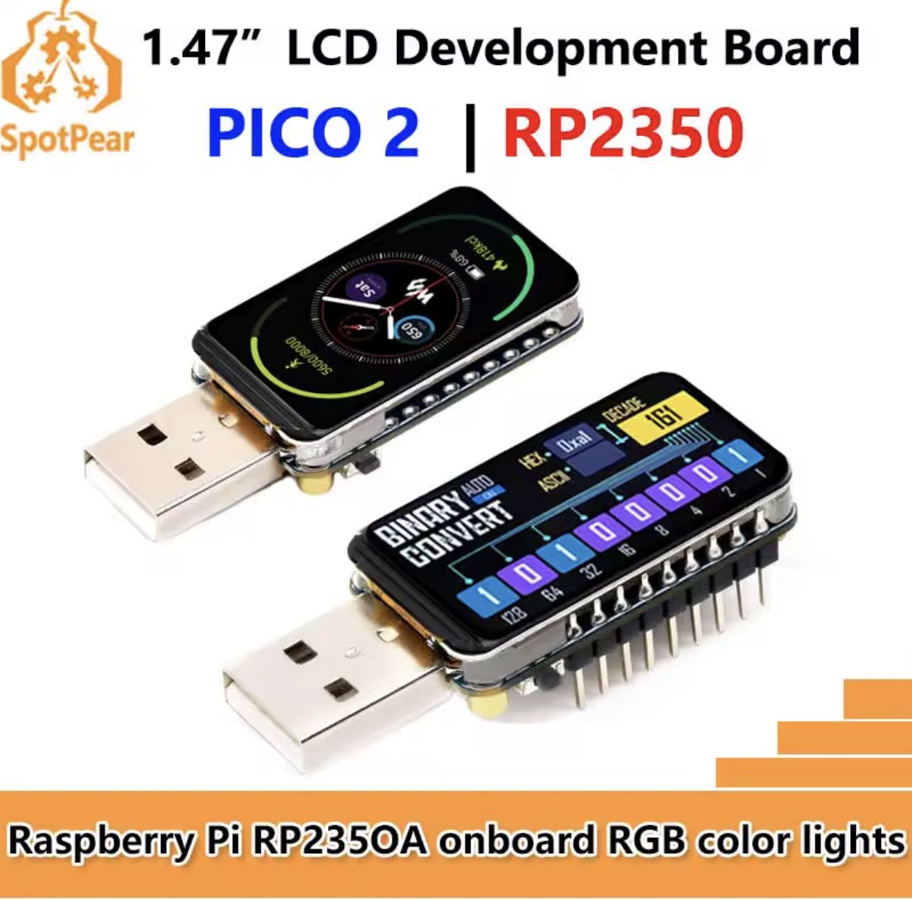

# USB IP Display for Headless Raspberry Pi

A USB dongle with LCD screen that displays the hostname and IP addresses of headless Raspberry Pi servers — **no monitor, keyboard, or GUI session required**.

This project was inspired by [rpi_usb_ip_display project](https://github.com/C4KEW4LK/rpi_usb_ip_display)



## Features

- Works on **headless** servers without any desktop environment
- Automatic IP display on USB plug-in
- Shows hostname, WiFi, Ethernet, and other interfaces
- Updates every 30 seconds
- Compatible with Raspberry Pi 3, 4, 5, and Zero 2 W
- Tested on Raspberry Pi OS Lite (Bookworm, Trixie)

## How It Works

Unlike the original project that emulates a USB keyboard to open a terminal, this version takes a different approach:

1. The RP2350 board acts as a USB CDC (serial) device
2. A systemd service on the Raspberry Pi detects the device via udev
3. The Pi sends hostname and IP addresses to the display via serial port
4. The display shows the information on the LCD screen

This approach works without any GUI session or logged-in user.

## Hardware

- **SpotPear/Waveshare RP2350 + 1.47" LCD board** (or similar Pico 2 board with Waveshare 1.47" LCD)
- Any Raspberry Pi with USB port

Purchase links:
- [AliExpress - SpotPear RP2350 LCD](https://www.aliexpress.com/item/1005008904795313.html)
- [Waveshare RP2350-LCD-1.47](https://www.waveshare.com/product/raspberry-pi/boards-kits/raspberry-pi-pico-8/rp2350-lcd-1.47-a.htm)

## Installation

### Step 1: Flash the Firmware

#### Prerequisites

1. Install [Arduino IDE 2.x](https://www.arduino.cc/en/software)
2. Add RP2350 board support:
   - Go to **Arduino IDE → Preferences**
   - Add to "Additional Boards Manager URLs":
     ```
     https://github.com/earlephilhower/arduino-pico/releases/download/global/package_rp2040_index.json
     ```
   - Go to **Tools → Board → Boards Manager...**
   - Search for "Raspberry Pi Pico/RP2040/RP2350" and install (version 4.0.0+)

#### Flashing

1. Download this repository

2. Open `firmware/HeadlessIpDisplay.ino` in Arduino IDE

3. Configure Arduino IDE:
   - **Tools → Board**: "Raspberry Pi Pico 2"
   - **Tools → USB Stack**: "Adafruit TinyUSB" ← Important!

4. Put the board into BOOTSEL mode:
   - Hold the BOOTSEL button
   - Connect USB cable
   - Release the button
   - The board appears as a USB drive

5. Click **Upload**

### Step 2: Setup Raspberry Pi

On each Raspberry Pi where you want to use the display, run:

```bash
# Download and run the setup script
curl -sSL https://raw.githubusercontent.com/VBaczynski/rpi-usb-ip-display-headless/main/raspberry-pi/setup-ip-display.sh | sudo bash
```

Or manually:

```bash
# Copy the script to your Pi
scp raspberry-pi/setup-ip-display.sh pi@your-pi-ip:~/

# Run it
ssh pi@your-pi-ip "sudo bash ~/setup-ip-display.sh"
```

### Step 3: Done!

Plug the display into any USB port on your Raspberry Pi. Within a few seconds, it will show:

- **HOST**: Hostname of the system
- **WIFI**: WiFi IP address (wlan0)
- **ETH**: Ethernet IP address (eth0)
- **OTHER**: VPN, Docker, or other interfaces

## Display Layout

```
┌──────────────────┐
│ HOST:            │
│ raspberrypi      │
│                  │
│ WIFI:            │
│ 192.168.1.100    │
│                  │
│ ETH:             │
│ 10.0.0.5         │
│                  │
│ Updated 5s ago   │
└──────────────────┘
```

## Management Commands

```bash
# Check timer status
sudo systemctl status usb-ip-display-refresh.timer

# View logs
journalctl -t usb-ip-display -n 20

# Manual refresh
sudo /usr/local/bin/usb-ip-display.sh

# Change refresh interval (default: 30 seconds)
sudo systemctl edit usb-ip-display-refresh.timer
```

## Uninstallation

```bash
sudo systemctl disable usb-ip-display-refresh.timer
sudo rm /etc/udev/rules.d/99-usb-ip-display.rules
sudo rm /etc/systemd/system/usb-ip-display*.service
sudo rm /etc/systemd/system/usb-ip-display*.timer
sudo rm /usr/local/bin/usb-ip-display.sh
sudo udevadm control --reload-rules
sudo systemctl daemon-reload
```

## Troubleshooting

### Display shows "Waiting..."

1. Check if Pi sees the device:
   ```bash
   ls -la /dev/ttyACM*
   lsusb | grep -i pico
   ```

2. Check logs:
   ```bash
   journalctl -t usb-ip-display -n 20
   dmesg | tail -20
   ```

3. Try manual test:
   ```bash
   echo "HOST:$(hostname)" > /dev/ttyACM0
   echo "ETH:192.168.1.1" > /dev/ttyACM0
   ```

### Device not detected

- Try a different USB port
- Check `dmesg` output when plugging in
- Ensure firmware was compiled with "Adafruit TinyUSB" USB Stack

### Timer not running

```bash
sudo systemctl status usb-ip-display-refresh.timer
sudo systemctl restart usb-ip-display-refresh.timer
```

## 3D Printed Case

The original 3D printed shell from [C4KEW4LK's project](https://github.com/C4KEW4LK/rpi_usb_ip_display/tree/main/3d%20printed%20shell). It uses M2x4mm screws and doesn't require supports.

## Credits & Attribution

This project is based on [rpi_usb_ip_display](https://github.com/C4KEW4LK/rpi_usb_ip_display) by [C4KEW4LK](https://github.com/C4KEW4LK).

**Key differences from the original:**
- Works on **headless** Raspberry Pi servers (no GUI session required)
- Uses systemd/udev instead of USB HID keyboard emulation
- Raspberry Pi sends data to the display (push model), not vice versa

LCD drivers are from [Waveshare](https://www.waveshare.com/).

3D printed shell design by C4KEW4LK.

Also, special thanks to **Claude AI**, who helped me create and debug the project.

## License

This project is licensed under the MIT License - see the [LICENSE](LICENSE) file for details.
